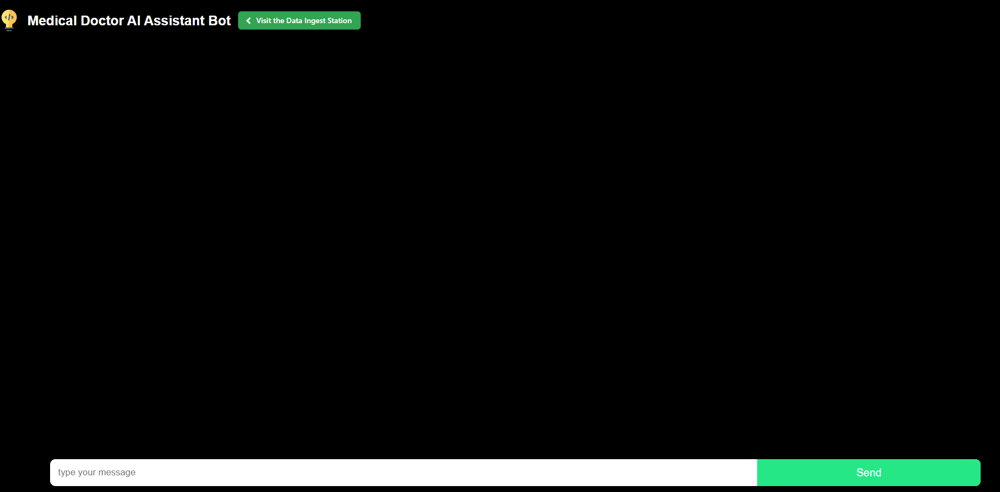
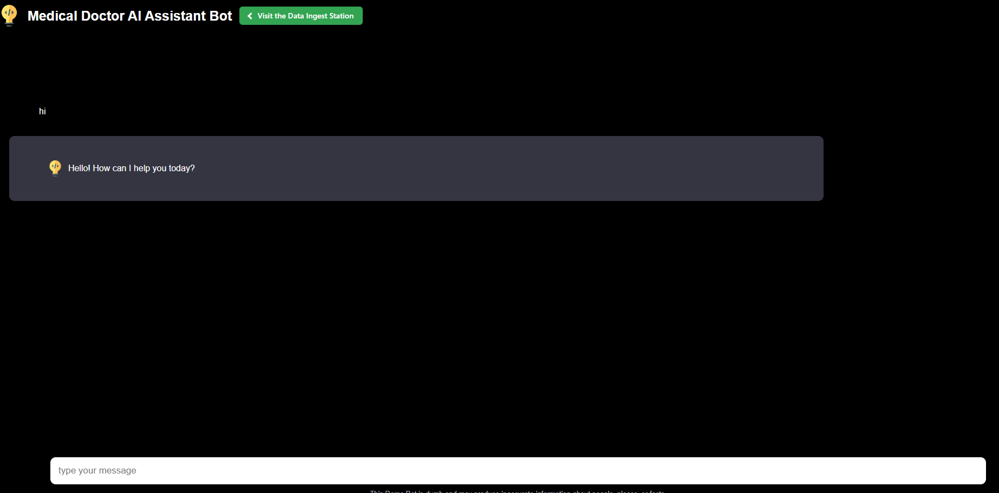
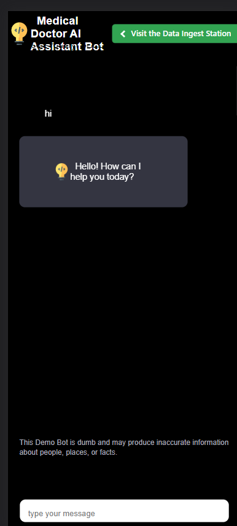

# Medical Doctor AI Helper Bot

Medical Doctor AI Helper Bot is an AI-powered chatbot designed to provide assistance and information on various medical topics. It can answer questions, provide recommendations, and offer support to users (Medical Staff) seeking Quick Medical Advice that could help them narrow down their exploration. It is important to note that this is a concept project and its functionality relies on indexed data. While it aims to mimic an AI Bot, it does not incorporate complex LLM or NLP techniques at this stage.

## Features

- Interactive chat interface for users to communicate with the chatbot.
- Utilizes a database of predefined questions and responses for accurate and relevant answers.
- Supports real-time interaction and provides instant responses.
- Built with PHP and MySQL for server-side processing and storage.
- User-friendly interface with a clean and intuitive design.

## Getting Started

To get started with the Medical Doctor AI Helper Bot, follow these steps:

1. Clone the repository to your local machine.
2. Set up a local web server environment (e.g., Apache, Nginx, LARAGON/MAMP or XAMPP stacks).
3. Import the database structure and sample data using the provided SQL file. Feel free to import your own Q/A.
4. Configure the database connection details in the PHP files (will introduce a config.php file in time maybe).
5. Open the application in a web browser to start interacting with the chatbot.
6. Tested with over 200k Medical Questions and Answers with full prepared statements and indexing.
7. Managed Input Sanitization and SQL Injection hacks.

## Directory Structure

- `index.php`: The main file that contains the chatbot interface and handles user interactions.
- `bot.php`: Handles the server-side processing of user messages and retrieves appropriate responses from the database.
- `ingest.php`: Imports data from JSON files into the chatbot's database for expanding its knowledge base.
- `fetch_response.php`: Retrieves a random response from the database for displaying in the chatbot interface.
- `training/`: Directory containing JSON files with additional data to be ingested into the chatbot's database.
- `css/`: Directory containing CSS stylesheets for styling the chatbot interface.
- `assets/`: Directory containing images and other static assets used in the application.

## Changelog

### v1.0.0 - Initial Release 
- Implemented basic chatbot functionality.
- Set up database structure and imported initial data.
- Created user interface for chat interactions.
- Added ingestion script for importing additional data.
- Implemented server-side processing of user messages.

### v1.1.0 - Feature Update (2023-06-09)
- Added progress bar and visual feedback during data ingestion.
- Improved error handling and error reporting during ingestion.
- Implemented input sanitization to enhance security.
- Updated CSS styles for better responsiveness on small screens and tablets.
- Fixed bugs and minor issues reported by users.

## License

This project is licensed under the Attribution License. See the [LICENSE](LICENSE) file for details.
